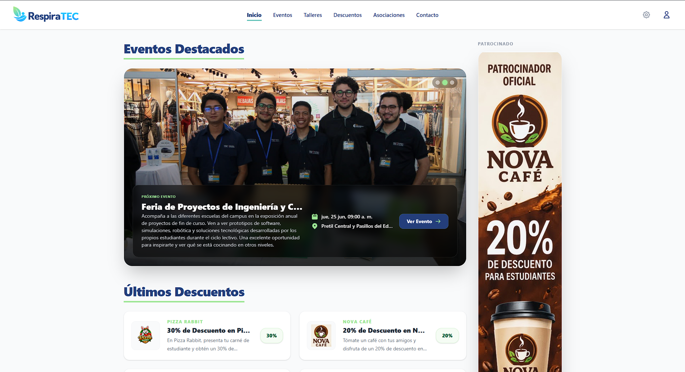
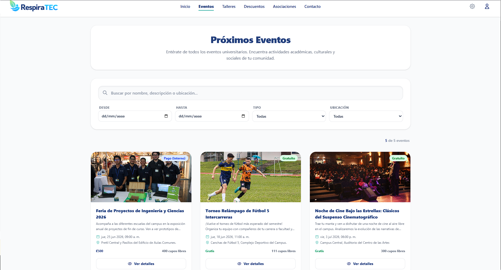
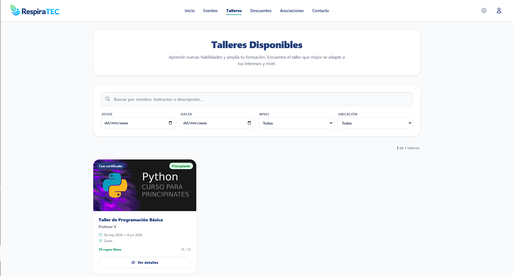
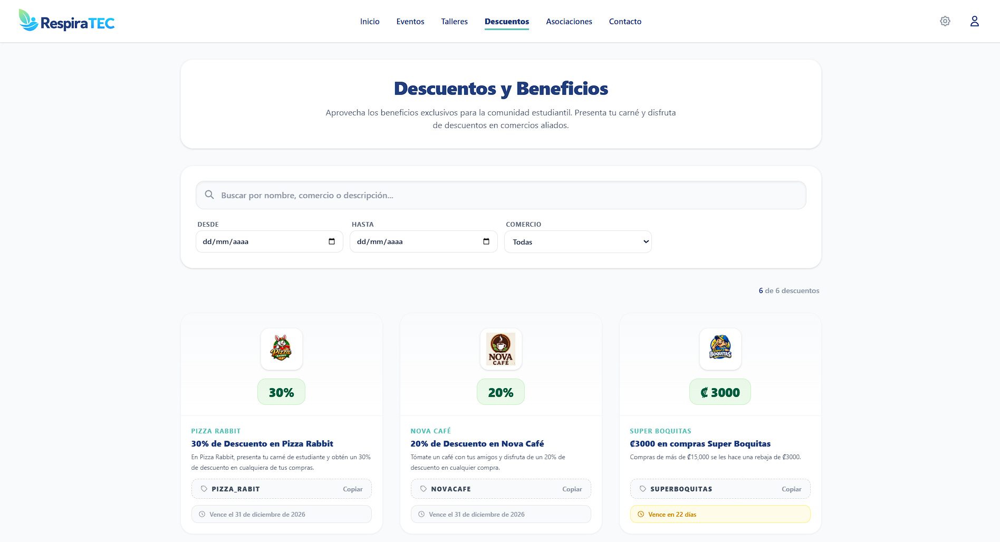
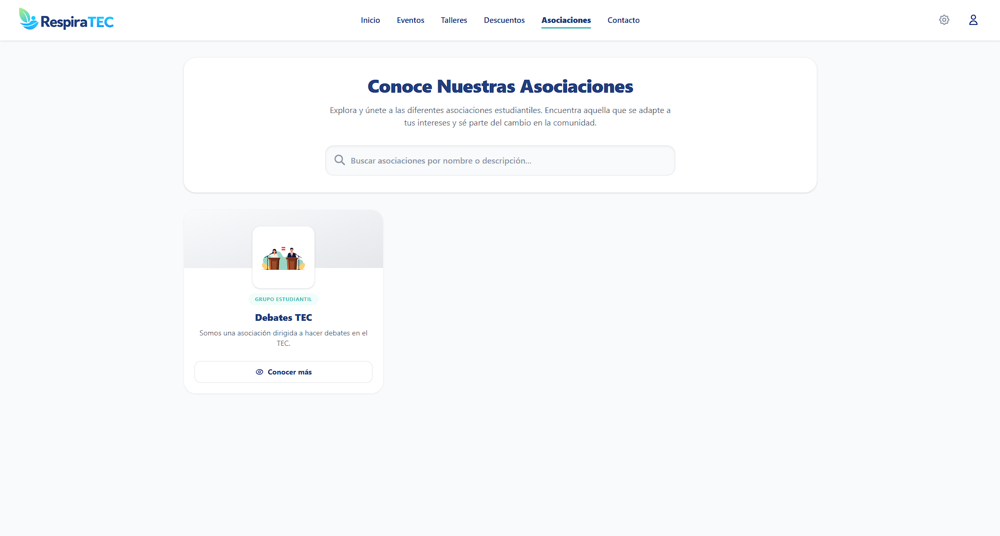
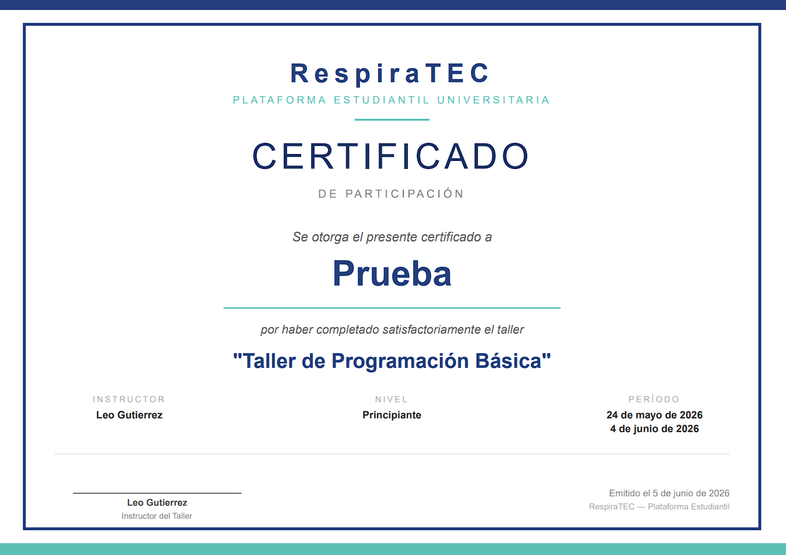
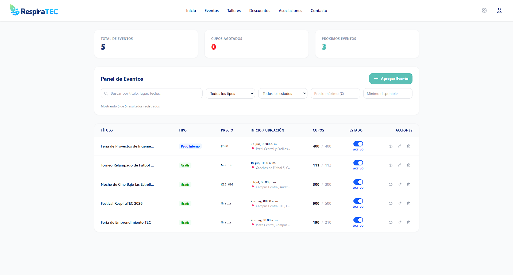

<div align="center">

  

  <br />
  <br />

  **Plataforma Estudiantil Universitaria**

  Centraliza eventos, talleres, descuentos y asociaciones estudiantiles en una experiencia moderna y premium.

  <br />

  
  
  
  
  
  
  

  <br />

  [🌐 Funcionalidades](#-funcionalidades) · [🏗️ Arquitectura](#️-arquitectura) · [🚀 Inicio Rápido](#-inicio-rápido) · [📸 Vistas de la Plataforma](#-vistas-de-la-plataforma)

</div>

<br />

---

<br />

## 🌱 ¿Qué es RespiraTEC?

El sitio oficial actual de la universidad para la visualización de eventos, talleres y descuentos estudiantiles es **poco visible, difícil de navegar y estéticamente anticuado**. Esto genera que muchas actividades y oportunidades extracurriculares pasen desapercibidas para la comunidad estudiantil.

**RespiraTEC** nace para resolver este problema, ofreciendo una interfaz **moderna, limpia y de alto nivel** que transforma la experiencia universitaria digital.

<br />

## ✨ Funcionalidades

<table>
<tr>
<td width="50%">

### 🎓 Para Estudiantes
- 📅 Explorar **eventos** universitarios con detalle completo
- 🎨 Inscribirse en **talleres** con sistema de cupos en tiempo real
- 🏷️ Acceder a **descuentos** exclusivos con códigos promocionales
- 🏛️ Solicitar membresía en **asociaciones** estudiantiles
- 📜 Descargar **certificados PDF** de talleres completados
- 👤 Gestionar su **perfil** y foto con Cloudinary
- ⭐ Dejar **feedback** y calificaciones de actividades

</td>
<td width="50%">

### 🛡️ Para Administradores
- 📊 **Panel de administración** completo (CRUD)
- 📝 Gestión de eventos, talleres, descuentos y asociaciones
- 👥 Administración de **usuarios** y roles
- ✅ Aprobación / rechazo de solicitudes de membresía
- 🖼️ Subida de imágenes con **Cloudinary**
- 📈 Conteo de asistentes e inscritos en tiempo real

</td>
</tr>
</table>

<br />

### 🔐 Sistema de Autenticación

| Característica | Descripción |
|:---|:---|
| **Registro seguro** | Contraseñas encriptadas con BcryptJS |
| **Sesiones JWT** | Tokens seguros con expiración configurable |
| **Roles dinámicos** | Estudiante · Representante · Administrador |
| **Rutas protegidas** | Acceso restringido según nivel de permisos |
| **Cooldown inteligente** | 24h de espera tras rechazo de membresía |

<br />

### 💳 Pasarela de Pago (Demo)

El sistema incluye una pasarela de pago simulada con dos métodos:

> **💠 Tarjeta de Crédito/Débito** — Formulario con validación de 16 dígitos, fecha y CVV con animación de procesamiento.
>
> **📱 SINPE Móvil** — Código QR simulado con confirmación instantánea tras verificación.

<br />

---

<br />

## 🏗️ Arquitectura

```
RespiraTEC/
│
├── 📁 frontend/                   # Aplicación React + Vite
│   ├── 📁 src/
│   │   ├── 📁 assets/             # Imágenes y recursos estáticos
│   │   ├── 📁 components/         # Componentes reutilizables
│   │   │   ├── Navbar.jsx         # Barra de navegación principal
│   │   │   ├── ModalPago.jsx      # Modal de pasarela de pago
│   │   │   ├── FeedbackSection.jsx
│   │   │   ├── FiltroBusqueda.jsx
│   │   │   └── ProtectedRoute.jsx
│   │   ├── 📁 context/            # Estado global (AuthContext)
│   │   ├── 📁 pages/
│   │   │   ├── 📁 admin/          # Paneles de administración
│   │   │   │   ├── 📁 eventos/
│   │   │   │   ├── 📁 talleres/
│   │   │   │   ├── 📁 descuentos/
│   │   │   │   ├── 📁 asociaciones/
│   │   │   │   └── 📁 usuarios/
│   │   │   ├── 📁 auth/           # Login y Registro
│   │   │   ├── 📁 public/         # Páginas públicas
│   │   │   │   ├── 📁 eventos/
│   │   │   │   ├── 📁 talleres/
│   │   │   │   ├── 📁 asociaciones/
│   │   │   │   ├── Descuentos.jsx
│   │   │   │   ├── Inicio.jsx
│   │   │   │   └── Contacto.jsx
│   │   │   └── 📁 user/           # Páginas de usuario
│   │   │       ├── MiPerfil.jsx
│   │   │       ├── MisAsociaciones.jsx
│   │   │       └── MisTalleres.jsx
│   │   └── App.jsx                # Enrutamiento principal
│   └── package.json
│
├── 📁 backend/                    # API REST con Express
│   ├── 📁 config/                 # Configuración de BD y Cloudinary
│   ├── 📁 controllers/            # Lógica de negocio
│   ├── 📁 middleware/             # Auth, validación y seguridad
│   ├── 📁 models/                 # Esquemas de Mongoose
│   │   ├── Usuario.js
│   │   ├── Evento.js
│   │   ├── Taller.js
│   │   ├── Descuento.js
│   │   ├── Asociacion.js
│   │   ├── Inscripcion.js
│   │   ├── AsistenciaEvento.js
│   │   ├── Afiliacion.js
│   │   └── Feedback.js
│   ├── 📁 routes/                 # Definición de endpoints
│   └── server.js                  # Punto de entrada
│
├── 📁 docs/screenshots/           # Capturas de pantalla
├── docker-compose.yml             # Orquestación con Docker
└── README.md
```

<br />

### 🔧 Stack Tecnológico

<table>
<tr>
<td align="center" width="33%">
<br />

**Frontend**

<br />

| Tecnología | Uso |
|:---:|:---|
| ⚛️ React | Interfaz de usuario |
| ⚡ Vite | Build & Dev Server |
| 🎨 Tailwind CSS | Sistema de diseño |
| 🧭 React Router | Navegación SPA |
| 🔑 Context API | Estado global |

</td>
<td align="center" width="33%">
<br />

**Backend**

<br />

| Tecnología | Uso |
|:---:|:---|
| 🟢 Node.js | Runtime |
| 🚂 Express | Framework HTTP |
| 🍃 MongoDB | Base de datos |
| 🔐 JWT | Autenticación |
| 🔒 BcryptJS | Hashing |

</td>
<td align="center" width="33%">
<br />

**Servicios**

<br />

| Tecnología | Uso |
|:---:|:---|
| ☁️ Cloudinary | Almacenamiento de imágenes |
| 📄 PDFKit | Generación de certificados |
| 🐳 Docker | Contenerización |
| 🛡️ Helmet | Seguridad HTTP |
| 🧹 Mongo Sanitize | Protección NoSQL |

</td>
</tr>
</table>

<br />

---

<br />

## 🚀 Inicio Rápido

### Requisitos Previos

| Software | Versión mínima |
|:---|:---|
| [Node.js](https://nodejs.org/) | `v18+` |
| [MongoDB](https://www.mongodb.com/) | `v6+` (local o Atlas) |
| [Docker](https://www.docker.com/) *(opcional)* | `v20+` |

<br />

### ⚙️ Opción 1 — Instalación Manual

<details>
<summary><strong>1️⃣ Clonar el repositorio</strong></summary>

<br />

```bash
git clone https://github.com/DanielAR27/RespiraTEC.git
cd RespiraTEC
```

</details>

<details>
<summary><strong>2️⃣ Configurar variables de entorno</strong></summary>

<br />

**`backend/.env`**
```env
PORT=5000
MONGO_URI=mongodb://localhost:27017/respiratec
JWT_SECRET=secreto_super_seguro
JWT_EXPIRE=24h

# Cloudinary (opcional, para subida de imágenes)
CLOUDINARY_CLOUD_NAME=cloud_name
CLOUDINARY_API_KEY=api_key
CLOUDINARY_API_SECRET=api_secret
```

**`frontend/.env`**
```env
VITE_API_URL=http://localhost:5000/api
```

</details>

<details>
<summary><strong>3️⃣ Levantar el Backend</strong></summary>

<br />

```bash
cd backend
npm install
npm run dev
```

> 🟢 El servidor se ejecutará en `http://localhost:5000`

</details>

<details>
<summary><strong>4️⃣ Levantar el Frontend</strong></summary>

<br />

```bash
cd frontend
npm install
npm run dev
```

> 🟢 La aplicación estará disponible en `http://localhost:5173`

</details>

<br />

### 🐳 Opción 2 — Docker Compose

```bash
docker-compose up --build
```

| Servicio | Puerto |
|:---|:---|
| Frontend | `http://localhost:80` |
| Backend | `http://localhost:3000` |

<br />

---

<br />

## 📸 Vistas de la Plataforma

A continuación se presentan las principales secciones de RespiraTEC. Las capturas se encuentran en la carpeta [`docs/screenshots/`](docs/screenshots/).

<br />

<div align="center">

### 🏠 Inicio

La página principal muestra un resumen dinámico de toda la actividad universitaria: eventos próximos, talleres destacados, descuentos activos y asociaciones disponibles. Diseñada para que el estudiante tenga toda la información relevante de un solo vistazo.



<br />

---

### 📅 Eventos

Explora todos los eventos universitarios con tarjetas visuales que muestran fecha, ubicación, categoría y un contador de asistentes en tiempo real. Cada evento tiene su vista de detalle con inscripción de asistencia y confirmación mediante modal.



<br />

---

### 🎨 Talleres

Catálogo completo de talleres con información de nivel (Principiante, Intermedio, Avanzado), instructor, fechas, cupos disponibles y precio. Los estudiantes pueden inscribirse con un flujo de pago simulado y, al finalizar el taller, descargar su certificado PDF.



<br />

---

### 🏷️ Descuentos

Sección de descuentos exclusivos para estudiantes con tarjetas que muestran el porcentaje de ahorro, código promocional copiable y fecha de vencimiento. Incluye filtros para encontrar las mejores ofertas rápidamente.



<br />

---

### 🏛️ Asociaciones

Directorio de asociaciones estudiantiles con logo, descripción y listado de miembros. Los estudiantes pueden solicitar membresía a través de un flujo intuitivo con modal de confirmación, y los representantes gestionan las solicitudes desde su panel.



<br />

---

### 📜 Certificados PDF

Los estudiantes que completaron un taller con certificación pueden descargar un diploma de participación generado automáticamente en PDF. El certificado incluye nombre del participante, título del taller, instructor, período y fecha de emisión con un diseño profesional.



<br />

---

### 🛡️ Panel de Administración

Panel completo para administradores con gestión CRUD de eventos, talleres, descuentos, asociaciones y usuarios. Interfaz limpia con tablas, filtros y acciones rápidas para mantener la plataforma actualizada.



</div>

<br />

---

<br />

## 🗺️ Roadmap

- [x] 🔐 Autenticación completa con JWT y roles
- [x] 📅 CRUD de eventos con asistencia en tiempo real
- [x] 🎨 CRUD de talleres con inscripción y cupos
- [x] 🏷️ Sistema de descuentos con códigos promocionales
- [x] 🏛️ Asociaciones con flujo de solicitud de membresía
- [x] 📜 Generación de certificados PDF con PDFKit
- [x] 💳 Pasarela de pago simulada (Tarjeta + SINPE)
- [x] ⭐ Sistema de feedback y calificaciones
- [x] 🔍 Filtros de búsqueda por categoría, fecha y ubicación
- [x] 🛡️ Panel de administración completo
- [x] 🐳 Contenerización con Docker Compose

<br />

---

<br />

## 👥 Equipo

<div align="center">

Hecho por estudiantes del **Tecnológico de Costa Rica**

<br />

| 👤  Integrante |
|:---|
|  **Daniel Alemán** |
|  **José Jiménez** |
|  **Luis Meza** |
|  **José Fabián Zumbado** |

</div>

<br />

---

<br />

<div align="center">

  

  <br />
  <br />

  **RespiraTEC** · Plataforma Estudiantil Universitaria

  <sub>Hecho con mucha pasión en Costa Rica</sub>

</div>
